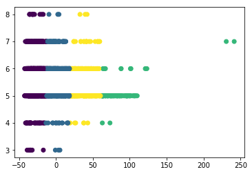

```python
import sys
import numpy as np
from sklearn import tree, svm, linear_model, neighbors
```


```python
data= np.genfromtxt("C:\winequality-red.csv", dtype=np.float32, delimiter = ";", skip_header=1, usecols = range(0,12))
```


```python
x= data[:,0:11] #array holding the training samples
```


```python
y=data[:,11] #array hodling the class labels
```


```python
from sklearn.model_selection import train_test_split
```


```python
x_train, x_test, y_train, y_test = train_test_split(x, y, test_size = 0.2)
```


```python
print (xtrain.shape, y_train.shape)
```


    ---------------------------------------------------------------------------

    NameError                                 Traceback (most recent call last)

    <ipython-input-9-e114a6a45d8f> in <module>
    ----> 1 print (xtrain.shape, y_train.shape)
    

    NameError: name 'xtrain' is not defined


```python
print (x_train.shape, y_train.shape)
```

    (1279, 11) (1279,)
    


```python
classifier = tree.DecisionTreeClassifier(random_state=0) #to make the outcome consistent across calls
classifier = classifier.fit(x_train,y_train)
predictied_class = classifier.predict(x_test)
```


```python
print(classifier.score(x_test, y_test))
```

    0.61875
    


```python
classifier = svm.SVC(random_state=0)
classifier = classifier.fit(x_train, y_train)
predicted_class=classifier.predict(x_test)
```

    C:\Users\tk090\Anaconda3\lib\site-packages\sklearn\svm\base.py:196: FutureWarning: The default value of gamma will change from 'auto' to 'scale' in version 0.22 to account better for unscaled features. Set gamma explicitly to 'auto' or 'scale' to avoid this warning.
      "avoid this warning.", FutureWarning)
    


```python
print(classifier.score(x_test, y_test))
```

    0.55625
    


```python
classifier = neighbors.KNeighborsClassifier(n_neighbors= 5)
classifier = classifier.fit(x_train, y_train)
predicted_class=classifier.predict(x_test)
```


```python
print(classifier.score(x_test, y_test))
```

    0.5
    


```python
def classifierD(info):
    classifier = tree.DecisionTreeClassifier(random_state=0) #to make the outcome consistent across calls
    classifier = classifier.fit(x,y)
    predictied_class = classifier.predict(info)
    return predictied_class
```


```python
def classifierS(info):
    classifier = svm.SVC(random_state=0)
    classifier = classifier.fit(x, y)
    predicted_class=classifier.predict(info)
    return predicted_class
```


```python
def classifierL(info):
    classifier = linear_model.LogisticRegression(random_state=0)
    classifier = classifier.fit(x, y)
    predicted_class=classifier.predict(info)
    return predicted_class
```


```python
def classifierk(info):
    classifier = neighbors.KNeighborsClassifier(n_neighbors= 5)
    classifier = classifier.fit(x, y)
    predicted_class=classifier.predict(info)
    return predicted_class
```


```python
while 1:
    print('1. Predict wine quality')
    print('2. Quit')
    a= input('> ')
    if a=='2':
        sys.exit(0)
    else: 
        print('Input the values of a wine:\n')
        fixed_a=float(input('1. fixed acidity: '))
        volatile_a =float(input('2. volatile acidity: '))
        citric_a =float(input('3. citric acid: '))
        residual = float(input('4. residual sugar: '))
        chlorides = float(input('5. chlorides: '))
        free=float(input('6. free sulfur dioxide: '))
        total = float(input('7. total sulfur dioxide: '))
        density= float(input('8. density: '))
        ph = float(input('9. pH: '))
        sul=float(input('10. sulphates: '))
        alcohol = float(input('11. alcohol: '))

        info = [[fixed_a, volatile_a, citric_a, residual, chlorides, free, total, density, ph, sul, alcohol]]

        print('\nPredicted wine quality:')
        print('1. Decistion Tree: ', int(classifierD(info)))
        print('2. Support vector machine: ',int(classifierS(info)))
        print('3. Logistic regression: ',int(classifierL(info)))
        print('4. k-NN classifier: ',int(classifierk(info)),'\n')
```

    1. Predict wine quality
    2. Quit
    > 1
    Input the values of a wine:
    
    1. fixed acidity: 6.8
    2. volatile acidity: 0.77
    3. citric acid: 0.02
    4. residual sugar: 1.8
    5. chlorides: 0.075
    6. free sulfur dioxide: 5
    7. total sulfur dioxide: 12
    8. density: 0.996
    9. pH: 3.55
    10. sulphates: 0.63
    11. alcohol: 9.91
    
    Predicted wine quality:
    1. Decistion Tree:  3
    

    C:\Users\tk090\Anaconda3\lib\site-packages\sklearn\svm\base.py:196: FutureWarning: The default value of gamma will change from 'auto' to 'scale' in version 0.22 to account better for unscaled features. Set gamma explicitly to 'auto' or 'scale' to avoid this warning.
      "avoid this warning.", FutureWarning)
    C:\Users\tk090\Anaconda3\lib\site-packages\sklearn\linear_model\logistic.py:433: FutureWarning: Default solver will be changed to 'lbfgs' in 0.22. Specify a solver to silence this warning.
      FutureWarning)
    C:\Users\tk090\Anaconda3\lib\site-packages\sklearn\linear_model\logistic.py:460: FutureWarning: Default multi_class will be changed to 'auto' in 0.22. Specify the multi_class option to silence this warning.
      "this warning.", FutureWarning)
    

    2. Support vector machine:  5
    3. Logistic regression:  5
    4. k-NN classifier:  5 
    
    1. Predict wine quality
    2. Quit
    > 2
    


    An exception has occurred, use %tb to see the full traceback.
    

    SystemExit: 0
    


    C:\Users\tk090\Anaconda3\lib\site-packages\IPython\core\interactiveshell.py:3275: UserWarning: To exit: use 'exit', 'quit', or Ctrl-D.
      warn("To exit: use 'exit', 'quit', or Ctrl-D.", stacklevel=1)
    


```python
from sklearn.cluster import AgglomerativeClustering, KMeans
```


```python
n_x = np.array(x)
model= AgglomerativeClustering(n_clusters = 4)  #default='euclidean','ward'
result = model.fit(n_x)
for i in range(0, 4):
    print("Cluster ",i,":", np.count_nonzero(result.labels_ == i)) #cluster labels for each point
```

    Cluster  0 : 210
    Cluster  1 : 352
    Cluster  2 : 678
    Cluster  3 : 359
    


```python
import matplotlib.pyplot as plt  
from sklearn.decomposition import PCA
```


```python
plt.figure(figsize=(10, 7))  
```


    <Figure size 720x504 with 0 Axes>


    <Figure size 720x504 with 0 Axes>


```python
model_k=KMeans(n_clusters=4, random_state=0) #the seed used by the random number generator
result_k = model_k.fit(n_x)
for i in range(0, 4):
    print("Cluster ",i,":", np.count_nonzero(result_k.labels_ == i))
```

    Cluster  0 : 722
    Cluster  1 : 511
    Cluster  2 : 102
    Cluster  3 : 264
    


```python
pca = PCA(n_components=1).fit(x)
pca_d = pca.transform(x)
```


```python
plt.scatter(pca_d[:, 0], y, c= result_k.labels_)
```


    <matplotlib.collections.PathCollection at 0x1367e3485f8>





```python
model_k=KMeans(n_clusters=3, random_state=0) #the seed used by the random number generator
result_k = model_k.fit(n_x)
for i in range(0, 3):
    print("Cluster ",i,":", np.count_nonzero(result_k.labels_ == i))
pca = PCA(n_components=1).fit(x)
pca_d = pca.transform(x)
plt.scatter(pca_d[:, 0], y, c= result_k.labels_)
```

    Cluster  0 : 812
    Cluster  1 : 241
    Cluster  2 : 546
    


    <matplotlib.collections.PathCollection at 0x1367e3ba860>


```python
n_x = np.array(x)
model= AgglomerativeClustering(n_clusters = 4)  #default='euclidean','ward'
result = model.fit(n_x)

plt.scatter(pca_d[:, 0], y, c= result.labels_,)
```


    <matplotlib.collections.PathCollection at 0x1367e46ffd0>


```python
from sklearn.metrics import confusion_matrix, accuracy_score, precision_score, recall_score, f1_score
```


```python
def evaluation(y_true, y_pred):
    cm= confusion_matrix(y_true, y_pred)
    print('1. Confusion matrix: \n', cm)
    print('2. Accuracy: ',  accuracy_score(y_true, y_pred))
    print('3. Precision: ', precision_score(y_true, y_pred, average=None))
    print('4. Recasll: ', recall_score(y_true, y_pred, average=None))
    print('5. F-measure: ', f1_score(y_true, y_pred, average=None),'\n')
```


```python
def clustering(n_clu):
    print("<hierarchical clustering>")
    n_x = np.array(x)
    model= AgglomerativeClustering(n_clusters = n_clu)
    result = model.fit(n_x)
    for i in range(0, n_clu):
        print("Cluster ",i,":", np.count_nonzero(result.labels_ == i))

    print("<k-means clustering>")
    model_k=KMeans(n_clusters=n_clu, random_state=0)
    result_k = model_k.fit(n_x)
    for i in range(0, n_clu):
        print("Cluster ",i,":", np.count_nonzero(result_k.labels_ == i))
```


```python
while 1:
    print('1. Predict wine quality')
    print('2. Evaluate wine prediction models')
    print('3. Cluster wines')
    print('4. Quit')
    a= input('> ')
    if a=='4':
        break
    elif a=='1': 
        print('Input the values of a wine:\n')
        fixed_a=float(input('1. fixed acidity: '))
        volatile_a =float(input('2. volatile acidity: '))
        citric_a =float(input('3. citric acid: '))
        residual = float(input('4. residual sugar: '))
        chlorides = float(input('5. chlorides: '))
        free=float(input('6. free sulfur dioxide: '))
        total = float(input('7. total sulfur dioxide: '))
        density= float(input('8. density: '))
        ph = float(input('9. pH: '))
        sul=float(input('10. sulphates: '))
        alcohol = float(input('11. alcohol: '))
        info = [[fixed_a, volatile_a, citric_a, residual, chlorides, free, total, density, ph, sul, alcohol]]

        print('\nPredicted wine quality:')
        print('1. Decistion Tree: ', int(classifierD(info)))
        print('2. Support vector machine: ',int(classifierS(info)))
        print('3. Logistic regression: ',int(classifierL(info)))
        print('4. k-NN classifier: ',int(classifierk(info)),'\n')

    elif a=='2':
        print('Decision tree:')
        y_predD = classifierD(x)
        evaluation(y_true, y_predD)
            
        print('Support vector machine: ')
        y_predS = classifierS(x)
        evaluation(y_true, y_predS)

        print('Logistic regression: ')
        y_predL = classifierL(x)
        evaluation(y_true, y_predL)

        print('k-NN classifier: ')
        y_predK = classifierk(x)
        evaluation(y_true, y_predK)

    elif a=='3':
        n_clu=int(input('Input the number of clusters: '))
        print("The number of wines in each cluster: \n")
        clustering(n_clu)
```

    1. Predict wine quality
    2. Evaluate wine prediction models
    3. Cluster wines
    4. Quit
    > 3
    Input the number of clusters: 4
    The number of wines in each cluster: 
    
    <hierarchical clustering>
    Cluster  0 : 210
    Cluster  1 : 352
    Cluster  2 : 678
    Cluster  3 : 359
    <k-means clustering>
    Cluster  0 : 722
    Cluster  1 : 511
    Cluster  2 : 102
    Cluster  3 : 264
    1. Predict wine quality
    2. Evaluate wine prediction models
    3. Cluster wines
    4. Quit
    > 4
    

